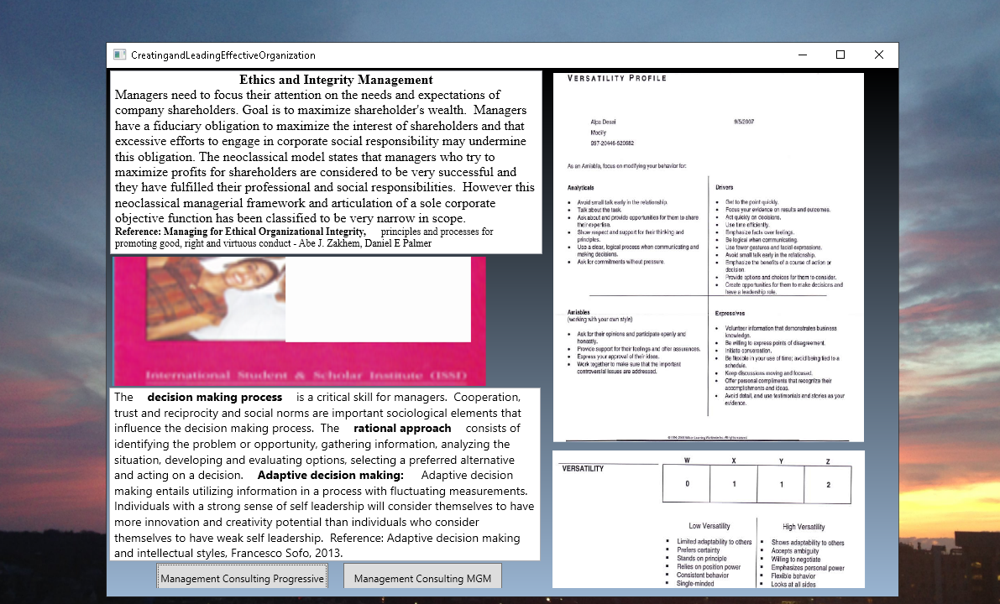

#  Leading Effective Organizations

The project provides an introduction to creating and leading effective organizations. Confidential information is not displayed. Please download the executable in https://github.com/alpaddesai/CreatingandLeadingEffectiveOrganizations/releases for details. All images are either custom by Alpa D Desai or a reference name is included. Most of the images are custom. 

## Creating and Leading Effective Organizations

## Dynamic Communications

## Ethics and Integrity

Advanced knowledge in  https://github.com/alpaddesai/EngineeringProjectManagement,  https://github.com/alpaddesai/BusinessDevelopmentMergersAcquisitionsIdea, https://github.com/alpaddesai/ManagingTechnologicalInnovation, https://github.com/alpaddesai/ManagementConsulting, and https://github.com/alpaddesai/VolunteerCommunityServicesinAmerica.
